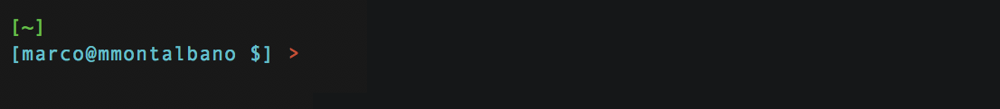
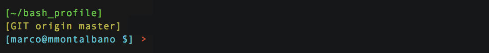
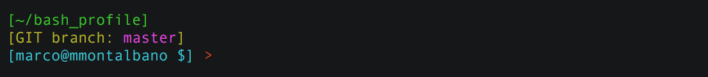
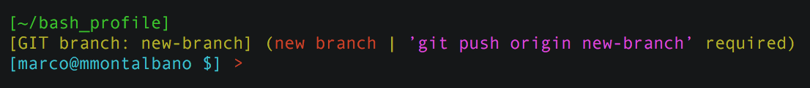
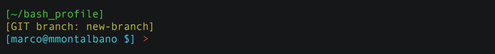
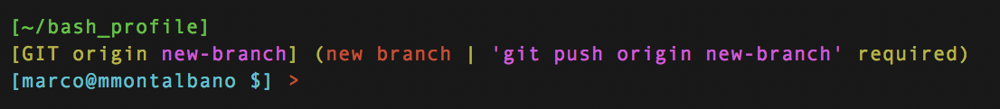
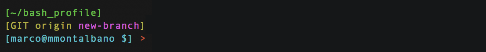

# .bash_profile

This is a collection of bash utilities. It contains:

- [x] PS1 customization with Git and Svn integration.
- [x] Bash Completions for Git, Svn, SSH and SFTP.
- [x] set/unset proxy faster.
- [x] Updatable `bash_profile` project.

[](https://asciinema.org/a/MEknLqkjqFCRHg8kQoT5G84r6)

## Get started

Clone this project in your home folder `~`.

```sh
cd ~ && git clone https://github.com/marcomontalbano/bash_profile.git
```

Open and modify your `$HOME/.bash_profile` on OS X and Windows or `$HOME/.bashrc` on Ubuntu, adding the following script.

```sh
# https://github.com/marcomontalbano/bash_profile
source ~/bash_profile/.bash_profile -u
```

### Options

- `-p <http-proxy>`: combined with `-u`, you can use self-update behind proxy.
- `-u`: enables self-update for bash_profile. (the latest release will automatically downloaded and loaded)
- `-w`: show welcome screen on new tabs.


## Completions

The following procedure works for OS X. If you are using Windows or Ubuntu, you don't need it. 

If you want to use the git, svn and ssh completion, just run following scripts.

```sh
# Bash Completion for GIT
curl https://raw.githubusercontent.com/git/git/master/contrib/completion/git-completion.bash -o ~/bash_profile/.bash_completion_git

# Bash Completion for SVN
curl http://svn.apache.org/repos/asf/subversion/trunk/tools/client-side/bash_completion -o ~/bash_profile/.bash_completion_svn

# Bash Completion for SSH and SFTP
curl https://gist.githubusercontent.com/marcomontalbano/7c48f6756e4e4133c30fdb8e1fff3100/raw -o ~/bash_profile/.bash_completion_ssh
```

## Useful Commands

### Bash Profile

- **bash_profile__path** - get project path.

- **bash_profile__cd** - `cd` to the `bash_profile` folder. Something like `cd ~/bash_profile`

- **bash_profile__version** - get current version.

- **bash_profile__reload** - reload the project.

- **bash_profile__reload_all** - reload your own `.bash_profile` or `.bashrc`.

- **bash_profile__update** - update the `bash_profile` project with latest changes. Is "just" a `git pull` :smile:

### General

Below a list of utilities that you can use on command line or your own .bash_profile.

- **console__set_title** - set a console title. _(only for OS X and Windows)_

- **cli__is_installed** - check if a program is installed on your system. *`cli__is_installed node` will return `true` if node is installed on your system, `false` otherwise.*

- **proxy__set** - simply set the command line proxy. It works also for npm and apm, if you use them. *usage: `proxy__set http://domain:8080` or `proxy__set http://domain:8080 https://domain:8080`*

- **proxy__unset** - simply unset the command line proxy.

- **network__get_ip** - get ip address _(e.g. 192.168.0.5)_

- **network__get_gateway** - get gateway address _(e.g. 192.168.0.1)_

- **network__get_broadcast** - get broadcast address _(e.g. 192.168.0.1)_

- **java__use_jdk** - if you work with different version of JDK, you can easily switch with `java__use_jdk 1.8`. _(only for OS X)_

### Git

- **git__update_date** - update last commit with current date. *usage: `git__update_date` or `git__update_date -v -5H`* _(only for OS X)_


## PS1 customization

PS1 is customized with multiple lines.

1. green label - you can fetch the **pwd** path.
1. yellow label _(optional)_ - it appear inside Git or Svn folders.
1. cyan label - you have the **username** @ **hostname**




### Git integration

_there are **no** changes on the active **master** branch_


_there are changes on the active **master** branch, but not committed yet_


_you have created a **new-branch**, but not pushed yet_


_you have created and pushed a **new-branch**_


_you have created a **new-branch** with some changes, but not committed and pushed yet_


_you have pushed the **new-branch**, but it has other changes to commit_

