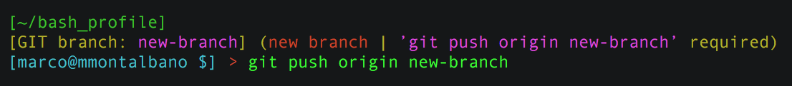

# .bash_profile

This is a collection of bash utilities. It contains:

- [x] PS1 customization with Git and Svn integration.
- [x] Bash Completions for Git and Svn.
- [x] set/unset proxy faster.
- [x] Updatable `bash_profile` project.
- [ ] Pygmentize


## Get started

Clone this project in your home folder `~`.

```sh
# clone with SSH
cd ~ && git clone git@github.com:marcomontalbano/bash_profile.git

# OR

# clone with HTTPS
cd ~ && git clone https://github.com/marcomontalbano/bash_profile.git
```

Open and modify your `~/.bash_profile` on OSX or `~/.bashrc` on Ubuntu, adding the following scripts.

```sh
# base import
source ~/bash_profile/.bash_profile

# PS1 customization with Git integration
source ~/bash_profile/.bash_profile__git

# PS1 customization with Svn integration
source ~/bash_profile/.bash_profile__svn
```


## Git and Svn completion (OSX only)

If you want to use the git and svn completion, just run following scripts.

```sh
# Bash Completion for GIT
curl https://raw.githubusercontent.com/git/git/master/contrib/completion/git-completion.bash -o ~/.bash_completion_git

# Bash Completion for SVN
curl http://svn.apache.org/repos/asf/subversion/trunk/tools/client-side/bash_completion -o ~/.bash_completion_svn
```


## Utilities

Below a list of utilities that you can use on command line or your own .bash_profile.

- **bash_profile__reload** - reload your `.bash_profile`.

- **bash_profile__update** - update the `bash_profile` project with latest changes. Is "just" a `git pull` :smile:

- **bash_profile__cd** - `cd` to the `bash_profile` folder. Something like `cd ~/bash_profile`

- **console__set_title** - set a console title. (tested only for the Terminal App on Mac OSX)

- **cli__is_installed** - check if a program is installed on your system. *`cli__is_installed node` will return `true` if node is installed on your system, `false` otherwise.*

- **proxy__set** - simply set the command line proxy. It works also for npm, if you use it. *usage: `proxy__set http://domain:8080`*

- **proxy__unset** - simply unset the command line proxy.

- **java__use_jdk** - if you work with different version of JDK, you can easily switch with `java__use_jdk 1.8`


## PS1 customization

PS1 is customized with multiple lines.

1. green label - you can fetch the **pwd** path.
1. yellow label _(optional)_ - it appear inside Git or Svn folders.
1. cyan label - you have the **username** @ **hostname**


### Git integration

_there are **no** changes on the active **master** branch_


_there are changes on the active **master** branch, but not committed yet_


_you have created a **new-branch**, but not pushed yet_


_you have created and pushed a **new-branch**_


_you have created a **new-branch** with some changes, but not committed and pushed yet_


_you have pushed the **new-branch**, but it has other changes to commit_

